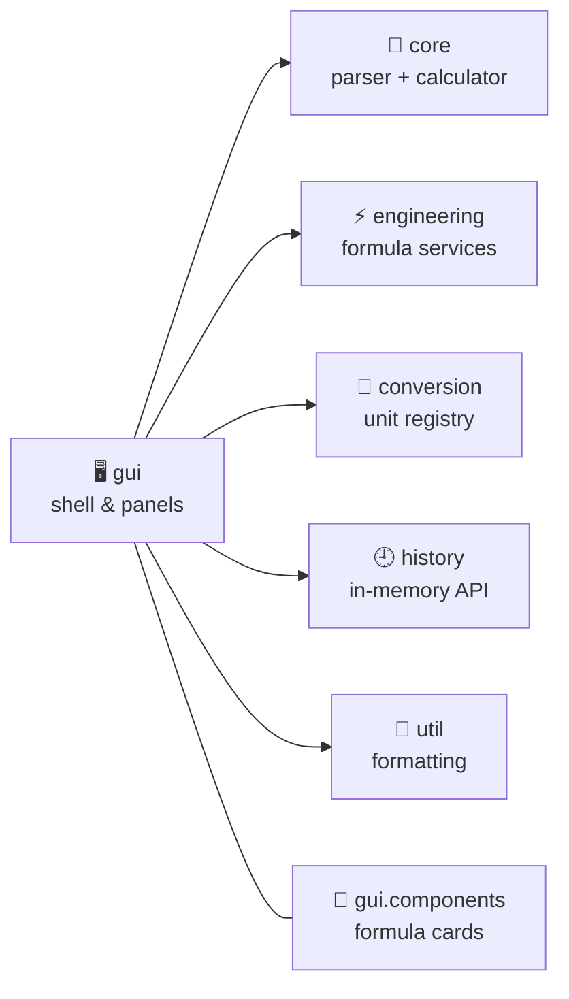

<div align="center">

# 🧮 Engineering Calculator

### A fast, safe and good-looking desktop calculator built for students, developers & engineers

<br>


<br>

[✨ Features](#-features) •
[📸 Screenshots](#-screenshots) •
[⬇️ Download](#️-download) •
[🛠️ Build](#️-build-from-source) •
[🏗️ Architecture](#️-architecture) •
[🗺️ Roadmap](#️-roadmap)

</div>

---

## 🌟 Overview

**Engineering Calculator** combines a **safe recursive-descent expression parser** with an **engineering formula workspace**, a **unit converter**, a **searchable help guide** and a **clickable history drawer** – all in one clean dark-themed Swing app.

> 🔒 No scripting engine. No `eval`. No arbitrary code execution – every expression is parsed and evaluated by our own parser.

---

## ✨ Features

| | Feature | Details |
| :-: | --- | --- |
| 🧠 | **Smart expression engine** | Precedence, parentheses, power, modulo, postfix `%` and `!`, constants `pi` & `e`, previous answer `ans` |
| 🔬 | **Scientific functions** | `sin` `cos` `tan` `asin` `acos` `atan` `log` `ln` `sqrt` `abs` `exp`, rounding functions, factorial |
| 📐 | **DEG / RAD switch** | Always-visible angle mode controlling trig and inverse trig |
| ⚡ | **Engineering cards** | Electrical, mechanics, physics, error analysis & quadratic solver – with labeled inputs, validation and reset |
| 🔄 | **Unit converter** | Length, mass, temperature, time, area and speed |
| 📚 | **Help guide** | Searchable topics with syntax, formula, example, units and shortcuts |
| 🕘 | **History drawer** | Click any recent expression to reuse it |
| ⌨️ | **Keyboard friendly** | `Enter` to calculate, `Esc` to clear, `Backspace` to delete |

---

## 🧪 Calculator examples

| Expression | Mode | Result |
| --- | :-: | :-: |
| `2 + 3 * 4` | – | **14** |
| `(10 + 5) * 2` | – | **30** |
| `50%` | – | **0.5** |
| `5%2` | – | **1** |
| `sin(90)` | 🟦 DEG | **1** |
| `sin(pi/2)` | 🟧 RAD | **1** |
| `sqrt(144)` | – | **12** |

---

## ⚡ Engineering formulas

Ohm's law • Electrical power • Series & parallel resistance • Voltage division • Force • Kinetic & potential energy • Density • Momentum • Work • Mechanical power • Error calculations • Real/complex quadratic solver

📄 Full list with syntax and examples: **[docs/formulas.md](docs/formulas.md)**

---

## ⌨️ Keyboard shortcuts

| Key | Action |
| :-: | --- |
| `0`–`9`, `.`, operators, parentheses | Enter expression |
| `Enter` | ✅ Calculate |
| `Escape` | 🧹 Clear expression and result |
| `Backspace` | ⌫ Delete selection or previous character |

---

## ⬇️ Download

<div align="center">

**🍎 macOS (Apple Silicon)** → `EngineeringCalculator-1.0.0.dmg`

*Generated in `dist/` by the packaging script below.*

</div>

The native app bundle ships with its **own Java runtime** – users don't need to install Java separately.

---

## 🛠️ Build from source

> Java 25 JDK is used for macOS packaging. The official **Maven Wrapper** downloads the pinned Maven on first run – no separate Maven install needed.

```bash
./mvnw clean test
./mvnw package
```

Run the packaged JAR *(a graphical desktop session is required)*:

```bash
java -jar target/engineering-calculator-1.0.0.jar
```

### 📦 Build the macOS installer

On an Apple Silicon Mac with Java 25 and `jpackage` available:

```bash
./scripts/package-macos.sh
```

The script will:

1. ✅ Run tests and package the project
2. 📁 Create `dist/Engineering Calculator.app` with a bundled runtime
3. 💿 Create and verify `dist/EngineeringCalculator-1.0.0.dmg`
4. 🎨 Use `src/main/resources/icons/EngineeringCalculator.icns` if you add that icon

> ℹ️ Native packages must be created on their target platform.

---

## 🏗️ Architecture

The business layer is **fully independent of Swing**, so it is easy to test and reuse.



<details>
<summary><b>📂 Project structure</b></summary>

```text
src/main/java/com/shalab/calculator/
  core/          expression parser and calculator engine
  engineering/   electrical, mechanics, physics and formula services
  conversion/    unit conversion registry
  history/       in-memory calculation history
  gui/           application shell and feature panels
    components/  reusable engineering formula card
  util/          number formatting
src/test/java/   JUnit 5 tests for core, engineering and conversion
```

</details>

---

## 🧰 Tech stack

| Layer | Technology |
| --- | --- |
| Language | ☕ Java 21 |
| UI | 🎨 Swing (no third-party UI framework) |
| Build | 📦 Maven (with Wrapper) |
| Testing | 🧪 JUnit 5 |

---

## 🧪 Testing

```bash
./mvnw clean test
```

The JUnit 5 suite covers expression arithmetic & precedence, scientific functions & invalid domains, engineering formulas & validation, quadratic roots and unit conversions.

---

## 🛡️ Error handling

- ❌ Invalid expressions and math-domain errors appear right in the calculator result area.
- 📝 Engineering forms report field and domain issues next to the relevant form.
- 🔒 Nothing is evaluated through a scripting engine or arbitrary code execution.

---

## 🗺️ Roadmap

- [ ] 📈 Graph plotting
- [ ] 🧮 Matrix calculations
- [ ] ➗ Extended complex arithmetic
- [ ] 💾 Persistent history
- [ ] 📤 Calculation export
- [ ] 🏭 More engineering domains
- [ ] 🎨 Configurable themes

---

## 👨‍💻 Author

<div align="center">

**Shalab Kumar Shrivastava**
B.Tech CSE · IoT, Cybersecurity & Blockchain Technology

[](https://github.com/aiverseofshalab)
[](https://linkedin.com/in/aiverseofshalab)

<br>

⭐ **If you like this project, give it a star!** ⭐

</div>
